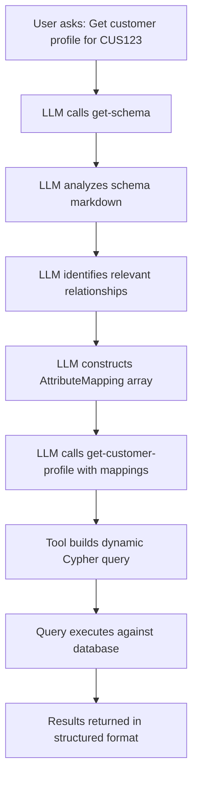

# Schema-Aware Tool Design for SAR Generation
## Building Dynamic, Graph-Agnostic Fraud Detection Tools

This document specifies the design pattern for creating SAR tools that dynamically adapt to any Neo4j graph schema, eliminating hardcoded Cypher queries and enabling true schema flexibility.

---

## Table of Contents

1. [Overview & Motivation](#overview--motivation)
2. [Architecture Pattern](#architecture-pattern)
3. [Detailed Example: get-customer-profile](#detailed-example-get-customer-profile)
4. [Reusable Design Components](#reusable-design-components)
5. [Implementation for Other SAR Tools](#implementation-for-other-sar-tools)
6. [Testing Strategy](#testing-strategy)
7. [Code Organization](#code-organization)

---

## Overview & Motivation

### The Problem with Hardcoded Queries

Traditional approach (❌ **DO NOT DO THIS**):
```go
// BAD: Hardcoded query assumes specific schema
query := `
    MATCH (c:Customer {customerId: $customerId})
    OPTIONAL MATCH (c)-[:HAS_EMAIL]->(e:Email)
    OPTIONAL MATCH (c)-[:HAS_PHONE]->(p:Phone)
    OPTIONAL MATCH (c)-[:HAS_SSN]->(s:SSN)
    RETURN c, collect(e) as emails, collect(p) as phones, collect(s) as ssns
`
```

**Problems:**
- Breaks if schema uses different relationship names (e.g., `PHONE` instead of `HAS_PHONE`)
- Breaks if property names differ (e.g., `emailAddress` instead of `address`)
- Cannot handle additional attributes without code changes
- Not reusable across different database schemas

### The Schema-Aware Solution

Inspired by `detect-synthetic-identity` tool (✅ **DO THIS**):
```go
// GOOD: Schema-aware - user provides schema mapping
type AttributeMapping struct {
    RelationshipType string  // e.g., "HAS_EMAIL"
    TargetLabel      string  // e.g., "Email"
    IdentifierProperty string // e.g., "address"
    AttributeCategory string  // e.g., "contact_information"
}

// User discovers schema first with get-schema
// Then passes discovered mappings to tool
mappings := []AttributeMapping{
    {RelationshipType: "HAS_EMAIL", TargetLabel: "Email", IdentifierProperty: "address", AttributeCategory: "contact"},
    {RelationshipType: "HAS_PHONE", TargetLabel: "Phone", IdentifierProperty: "number", AttributeCategory: "contact"},
    {RelationshipType: "HAS_SSN", TargetLabel: "SSN", IdentifierProperty: "number", AttributeCategory: "identity"},
}

// Tool builds query dynamically based on actual schema
query := buildCustomerProfileQuery(mappings)
```

**Benefits:**
- ✅ Works with ANY schema structure
- ✅ User controls what attributes to retrieve
- ✅ No code changes needed for schema variations
- ✅ Self-documenting through explicit mapping
- ✅ Fails gracefully if relationships don't exist

### Critical Pattern: WITH Clause for Aggregation

**Problem:** Neo4j throws an error when mixing non-aggregated properties with `collect()` in the same RETURN:

```cypher
-- ❌ BAD: Causes "Aggregation column contains implicit grouping expressions" error
MATCH (c:Customer {customerId: $id})
OPTIONAL MATCH (c)-[:HAS_EMAIL]->(e:Email)
RETURN {
  firstName: c.firstName,           -- Non-aggregated
  lastName: c.lastName,              -- Non-aggregated
  emails: collect(DISTINCT e.address) -- Aggregated
}
```

**Solution:** Use a WITH clause to separate grouping from aggregation:

```cypher
-- ✅ GOOD: WITH clause properly separates concerns
MATCH (e:Customer {customerId: $entityId})
OPTIONAL MATCH (e)-[:HAS_EMAIL]->(email0:Email)
WITH e, email0,
     e.firstName as firstName,
     e.lastName as lastName
RETURN {
  base_details: {
    firstName: firstName,
    lastName: lastName
  },
  contact_information: {
    emails: collect(DISTINCT {address: email0.address})
  }
}
```

**Key Principle:** All entity-agnostic tools now use:
1. Dynamic node labels and properties (no hardcoded "Customer")
2. WITH clause to project base properties as variables
3. RETURN clause safely mixes grouped and aggregated data

---

## Architecture Pattern

### Workflow: Schema Discovery → Tool Invocation



### Schema Discovery Process

**Step 1: get-schema returns markdown like this:**

```markdown
## 1. Node Labels and Properties

### Customer

*Properties:*
  - `customerId` (STRING)
  - `firstName` (STRING)
  - `lastName` (STRING)
  - `dateOfBirth` (DATE)
  - `nationality` (STRING)

*Relationships:*
  - `(:Customer)-[:HAS_EMAIL]->(:Email)`
  - `(:Customer)-[:HAS_PHONE]->(:Phone)`
  - `(:Customer)-[:HAS_SSN]->(:SSN)`
  - `(:Customer)-[:HAS_ADDRESS]->(:Address)`
  - `(:Customer)-[:HAS_DRIVER_LICENSE]->(:DriverLicense)`
  - `(:Customer)-[:OWNS]->(:Account)`

### Email

*Properties:*
  - `address` (STRING)
  - `verified` (BOOLEAN)
  - `createdAt` (DATETIME)

### Phone

*Properties:*
  - `number` (STRING)
  - `type` (STRING)
  - `primary` (BOOLEAN)

### SSN

*Properties:*
  - `number` (STRING)
  - `issuedDate` (DATE)
```

**Step 2: LLM parses schema and constructs mappings**

The LLM identifies:
- Customer node has relationship `HAS_EMAIL` to `Email` node
- Email node has property `address` containing the actual email
- Phone node has property `number` containing the phone number
- etc.

**Step 3: LLM constructs AttributeMapping array**

```json
{
  "entityId": "CUS123",
  "entityConfig": {
    "nodeLabel": "Customer",
    "idProperty": "customerId",
    "baseProperties": ["firstName", "lastName", "dateOfBirth", "nationality"]
  },
  "attributeMappings": [
    {
      "relationshipType": "HAS_EMAIL",
      "targetLabel": "Email",
      "identifierProperty": "address",
      "attributeCategory": "contact_information",
      "includeProperties": ["verified", "createdAt"]
    },
    {
      "relationshipType": "HAS_PHONE",
      "targetLabel": "Phone",
      "identifierProperty": "number",
      "attributeCategory": "contact_information",
      "includeProperties": ["type", "primary"]
    },
    {
      "relationshipType": "HAS_SSN",
      "targetLabel": "SSN",
      "identifierProperty": "number",
      "attributeCategory": "identity_documents",
      "includeProperties": ["issuedDate"]
    },
    {
      "relationshipType": "HAS_ADDRESS",
      "targetLabel": "Address",
      "identifierProperty": null,
      "attributeCategory": "contact_information",
      "includeProperties": ["street", "city", "state", "zip", "country", "type", "validFrom", "validTo"]
    },
    {
      "relationshipType": "HAS_DRIVER_LICENSE",
      "targetLabel": "DriverLicense",
      "identifierProperty": "number",
      "attributeCategory": "identity_documents",
      "includeProperties": ["state", "expiryDate"]
    }
  ],
  "includeAccounts": true,
  "includeRelationships": false
}
```

---

## Detailed Example: get-customer-profile

### Tool Specification

**File:** `internal/tools/data/customer_profile/spec.go`

```go
package customer_profile

import (
    "github.com/mark3labs/mcp-go/mcp"
    "github.com/mkd-neo4j/neo4j-mcp-fraud/internal/tools/cypher/query_builder"
)

// EntityConfig defines the configuration for the entity node to retrieve
type EntityConfig struct {
    // NodeLabel is the label of the entity node (e.g., "Customer", "Person", "Account")
    NodeLabel string `json:"nodeLabel" jsonschema:"description=Node label of the entity (e.g. Customer, Person, Account)"`

    // IdProperty is the property name containing the unique identifier (e.g., "customerId", "personId")
    IdProperty string `json:"idProperty" jsonschema:"description=Property name for unique identifier (e.g. customerId, personId)"`

    // BaseProperties are the properties from the entity node to include in base details.
    // If empty, all properties will be returned using properties() function.
    BaseProperties []string `json:"baseProperties,omitempty" jsonschema:"description=List of base properties to include (e.g. [firstName, lastName, dateOfBirth]). If empty, returns all properties."`
}

// GetCustomerProfileInput defines the input for the get-customer-profile tool
type GetCustomerProfileInput struct {
    // EntityId is the unique identifier for the entity (required)
    EntityId string `json:"entityId" jsonschema:"description=Entity ID to retrieve profile for (required)"`

    // EntityConfig defines the entity node configuration
    EntityConfig EntityConfig `json:"entityConfig" jsonschema:"description=Configuration for the entity node (node label, ID property, base properties)"`

    // AttributeMappings defines which attributes to retrieve based on the actual schema.
    // Discovered via get-schema tool.
    AttributeMappings []query_builder.AttributeMapping `json:"attributeMappings" jsonschema:"description=Array of attribute mappings discovered from the schema. Use get-schema to discover these first."`

    // IncludeAccounts determines whether to include account information
    IncludeAccounts bool `json:"includeAccounts,omitempty" jsonschema:"default=true,description=Include account information in the profile"`

    // IncludeRelationships determines whether to include related entities
    IncludeRelationships bool `json:"includeRelationships,omitempty" jsonschema:"default=false,description=Include related entities (beneficial owners, authorized users, etc.)"`
}

// Spec returns the MCP tool specification
func Spec() mcp.Tool {
    return mcp.NewTool("get-customer-profile",
        mcp.WithDescription(`Retrieves comprehensive customer profile information for SAR Section 1.3 (Subject Identity Details).

**SCHEMA-AWARE DESIGN:**
This tool dynamically adapts to your database schema. It does NOT make assumptions about relationship names, node labels, or property names.

**REQUIRED WORKFLOW:**
1. **Call get-schema** to discover your database structure
2. **Analyze the Customer node** to identify attribute relationships (e.g., HAS_EMAIL, HAS_PHONE, HAS_SSN, HAS_ADDRESS, HAS_DRIVER_LICENSE)
3. **For each attribute**, construct an AttributeMapping with:
   - relationshipType: The relationship name from your schema
   - targetLabel: The connected node label from your schema
   - identifierProperty: The property containing the key identifier (e.g., "address" for Email, "number" for Phone/SSN)
   - attributeCategory: Logical grouping ("contact_information", "identity_documents", "employment_details", "account_information")
   - includeProperties: Optional list of specific properties to retrieve
4. **Pass discovered mappings** to this tool's attributeMappings parameter

**EXAMPLE ATTRIBUTE MAPPINGS:**

For standard identity attributes:
[
  {
    "relationshipType": "HAS_EMAIL",
    "targetLabel": "Email",
    "identifierProperty": "address",
    "attributeCategory": "contact_information",
    "includeProperties": ["verified", "createdAt"]
  },
  {
    "relationshipType": "HAS_PHONE",
    "targetLabel": "Phone",
    "identifierProperty": "number",
    "attributeCategory": "contact_information",
    "includeProperties": ["type", "primary"]
  },
  {
    "relationshipType": "HAS_SSN",
    "targetLabel": "SSN",
    "identifierProperty": "number",
    "attributeCategory": "identity_documents",
    "includeProperties": ["issuedDate"]
  },
  {
    "relationshipType": "HAS_ADDRESS",
    "targetLabel": "Address",
    "identifierProperty": null,
    "attributeCategory": "contact_information",
    "includeProperties": ["street", "city", "state", "zip", "country", "type", "validFrom", "validTo"]
  },
  {
    "relationshipType": "HAS_DRIVER_LICENSE",
    "targetLabel": "DriverLicense",
    "identifierProperty": "number",
    "attributeCategory": "identity_documents",
    "includeProperties": ["state", "expiryDate"]
  }
]

**WHEN TO USE THIS TOOL:**
- Gathering subject identity details for SAR Section 1.3
- Collecting customer information for KYC/CDD compliance
- Creating comprehensive customer profiles for investigations
- Verifying identity document completeness

**SAR SECTIONS ADDRESSED:**
- Section 1.3: Client/Recipient of Service (identity details)
- Section 1.4: Activities/Location (employment, business details)
- Section 2.5: Other Parties (when includeRelationships=true)

**OUTPUT STRUCTURE:**
Returns a structured customer profile organized by attribute categories:
- personal_details: firstName, lastName, dateOfBirth, nationality, etc.
- contact_information: emails, phones, addresses
- identity_documents: SSN, driver license, passport, etc.
- employment_details: occupation, employer, business type
- account_information: accounts owned by the customer
- relationships: beneficial owners, authorized users (if requested)

**EXAMPLE USAGE:**
User: "Get the complete profile for customer CUS123 including all identity documents"
LLM: [calls get-schema, analyzes Customer relationships, constructs AttributeMappings, calls get-customer-profile]`),
        mcp.WithInputSchema[GetCustomerProfileInput](),
        mcp.WithTitleAnnotation("Get Customer Profile for SAR"),
        mcp.WithReadOnlyHintAnnotation(true),
        mcp.WithDestructiveHintAnnotation(false),
        mcp.WithIdempotentHintAnnotation(true),
        mcp.WithOpenWorldHintAnnotation(true),
    )
}
```

---

### Handler Implementation

**File:** `internal/tools/fraud/customer_profile/handler.go`

```go
package customer_profile

import (
    "context"
    "fmt"
    "log/slog"
    "strings"

    "github.com/mark3labs/mcp-go/mcp"
    "github.com/mkd-neo4j/neo4j-mcp-fraud/internal/tools/fraud"
)

// Handler returns the tool handler function
func Handler(deps *fraud.ToolDeps) func(context.Context, mcp.CallToolRequest) (*mcp.CallToolResult, error) {
    return func(ctx context.Context, request mcp.CallToolRequest) (*mcp.CallToolResult, error) {
        return handleGetCustomerProfile(ctx, request, deps)
    }
}

func handleGetCustomerProfile(ctx context.Context, request mcp.CallToolRequest, deps *fraud.ToolDeps) (*mcp.CallToolResult, error) {
    // Validate dependencies
    if deps.AnalyticsService == nil {
        errMessage := "Analytics service is not initialized"
        slog.Error(errMessage)
        return mcp.NewToolResultError(errMessage), nil
    }

    if deps.DBService == nil {
        errMessage := "Database service is not initialized"
        slog.Error(errMessage)
        return mcp.NewToolResultError(errMessage), nil
    }

    // Emit analytics event
    deps.AnalyticsService.EmitEvent(
        deps.AnalyticsService.NewToolsEvent("get-customer-profile"),
    )

    // Parse arguments
    var args GetCustomerProfileInput
    if err := request.BindArguments(&args); err != nil {
        slog.Error("error binding arguments", "error", err)
        return mcp.NewToolResultError(err.Error()), nil
    }

    // Validate required parameters
    if args.CustomerId == "" {
        errMessage := "customerId parameter is required"
        slog.Error(errMessage)
        return mcp.NewToolResultError(errMessage), nil
    }

    if len(args.AttributeMappings) == 0 {
        errMessage := "attributeMappings parameter is required and cannot be empty. Use get-schema to discover available attributes first."
        slog.Error(errMessage)
        return mcp.NewToolResultError(errMessage), nil
    }

    slog.Info("retrieving customer profile",
        "customerId", args.CustomerId,
        "attributeMappings", len(args.AttributeMappings),
        "includeAccounts", args.IncludeAccounts,
        "includeRelationships", args.IncludeRelationships)

    // Build dynamic Cypher query based on attribute mappings
    query := buildCustomerProfileQuery(args.AttributeMappings, args.IncludeAccounts, args.IncludeRelationships)

    params := map[string]any{
        "customerId": args.CustomerId,
    }

    slog.Debug("executing customer profile query", "query", query)

    // Execute query
    records, err := deps.DBService.ExecuteReadQuery(ctx, query, params)
    if err != nil {
        slog.Error("error executing customer profile query", "error", err)
        return mcp.NewToolResultError(err.Error()), nil
    }

    // Format records to JSON
    response, err := deps.DBService.Neo4jRecordsToJSON(records)
    if err != nil {
        slog.Error("error formatting query results", "error", err)
        return mcp.NewToolResultError(err.Error()), nil
    }

    return mcp.NewToolResultText(response), nil
}

// buildCustomerProfileQuery constructs a dynamic Cypher query based on attribute mappings
func buildCustomerProfileQuery(mappings []AttributeMapping, includeAccounts bool, includeRelationships bool) string {
    var queryBuilder strings.Builder

    // Start with base Customer match
    queryBuilder.WriteString(`
        MATCH (c:Customer {customerId: $customerId})
    `)

    // Group mappings by category for organized output
    categorizedMappings := groupMappingsByCategory(mappings)

    // Build OPTIONAL MATCH clauses for each attribute
    var returnClauses []string

    // Always return base customer properties
    returnClauses = append(returnClauses, `
        personal_details: {
            customerId: c.customerId,
            firstName: c.firstName,
            lastName: c.lastName,
            dateOfBirth: c.dateOfBirth,
            nationality: c.nationality
        }`)

    // Build OPTIONAL MATCH and collection for each category
    for category, categoryMappings := range categorizedMappings {
        categoryVar := strings.ReplaceAll(category, "_", "")

        for i, mapping := range categoryMappings {
            varName := fmt.Sprintf("%s%d", categoryVar, i)

            // Build OPTIONAL MATCH clause
            queryBuilder.WriteString(fmt.Sprintf(`
        OPTIONAL MATCH (c)-[:%s]->(%s:%s)`,
                mapping.RelationshipType,
                varName,
                mapping.TargetLabel))
        }

        // Build collection for this category
        returnClause := buildCategoryReturnClause(category, categoryMappings)
        returnClauses = append(returnClauses, returnClause)
    }

    // Add account information if requested
    if includeAccounts {
        queryBuilder.WriteString(`
        OPTIONAL MATCH (c)-[:OWNS]->(acc:Account)`)

        returnClauses = append(returnClauses, `
        account_information: {
            accounts: collect(DISTINCT {
                accountNumber: acc.accountNumber,
                accountType: acc.accountType,
                openedDate: acc.openedDate,
                status: acc.status,
                balance: acc.balance
            })
        }`)
    }

    // Add relationship information if requested
    if includeRelationships {
        queryBuilder.WriteString(`
        OPTIONAL MATCH (c)-[:BENEFICIAL_OWNER_OF]->(entity:Entity)
        OPTIONAL MATCH (c)-[:AUTHORIZED_USER_OF]->(authAcc:Account)<-[:OWNS]-(accountOwner:Customer)`)

        returnClauses = append(returnClauses, `
        relationships: {
            beneficialOwnerOf: collect(DISTINCT {
                entityId: entity.entityId,
                entityName: entity.name,
                entityType: entity.type
            }),
            authorizedUserOf: collect(DISTINCT {
                accountNumber: authAcc.accountNumber,
                accountOwner: accountOwner.customerId,
                accountOwnerName: accountOwner.firstName + ' ' + accountOwner.lastName
            })
        }`)
    }

    // Build RETURN clause
    queryBuilder.WriteString("\nRETURN {\n")
    queryBuilder.WriteString(strings.Join(returnClauses, ",\n"))
    queryBuilder.WriteString("\n} as customerProfile")

    return queryBuilder.String()
}

// groupMappingsByCategory organizes attribute mappings by their category
func groupMappingsByCategory(mappings []AttributeMapping) map[string][]AttributeMapping {
    categorized := make(map[string][]AttributeMapping)

    for _, mapping := range mappings {
        category := mapping.AttributeCategory
        if category == "" {
            category = "other_attributes"
        }
        categorized[category] = append(categorized[category], mapping)
    }

    return categorized
}

// buildCategoryReturnClause constructs the RETURN clause for a category of attributes
func buildCategoryReturnClause(category string, mappings []AttributeMapping) string {
    categoryVar := strings.ReplaceAll(category, "_", "")

    var collections []string

    for i, mapping := range mappings {
        varName := fmt.Sprintf("%s%d", categoryVar, i)

        // Build property map based on includeProperties
        var propMap string
        if len(mapping.IncludeProperties) > 0 {
            // Specific properties requested
            var propPairs []string
            if mapping.IdentifierProperty != "" {
                propPairs = append(propPairs, fmt.Sprintf("%s: %s.%s",
                    mapping.IdentifierProperty, varName, mapping.IdentifierProperty))
            }
            for _, prop := range mapping.IncludeProperties {
                propPairs = append(propPairs, fmt.Sprintf("%s: %s.%s", prop, varName, prop))
            }
            propMap = strings.Join(propPairs, ", ")
        } else {
            // Return all properties
            if mapping.IdentifierProperty != "" {
                propMap = fmt.Sprintf("identifier: %s.%s, properties: properties(%s)",
                    varName, mapping.IdentifierProperty, varName)
            } else {
                propMap = fmt.Sprintf("properties: properties(%s)", varName)
            }
        }

        // Use target label (lowercase) as the collection key
        collectionKey := strings.ToLower(mapping.TargetLabel) + "s"
        collections = append(collections, fmt.Sprintf(`
            %s: collect(DISTINCT {%s})`, collectionKey, propMap))
    }

    return fmt.Sprintf(`
        %s: {%s
        }`, category, strings.Join(collections, ","))
}
```

---

### Generated Query Example

Given the EntityConfig and AttributeMappings above, the tool would generate:

```cypher
MATCH (e:Customer {customerId: $entityId})
OPTIONAL MATCH (e)-[:HAS_EMAIL]->(attr0:Email)
OPTIONAL MATCH (e)-[:HAS_PHONE]->(attr1:Phone)
OPTIONAL MATCH (e)-[:HAS_ADDRESS]->(attr2:Address)
OPTIONAL MATCH (e)-[:HAS_SSN]->(attr3:SSN)
OPTIONAL MATCH (e)-[:HAS_DRIVER_LICENSE]->(attr4:DriverLicense)
OPTIONAL MATCH (e)-[:OWNS]->(acc:Account)
WITH e, attr0, attr1, attr2, attr3, attr4, acc,
     e.firstName as firstName,
     e.lastName as lastName,
     e.dateOfBirth as dateOfBirth,
     e.nationality as nationality
RETURN {
    base_details: {
        firstName: firstName,
        lastName: lastName,
        dateOfBirth: dateOfBirth,
        nationality: nationality
    },
    contact_information: {
        emails: collect(DISTINCT {address: attr0.address, verified: attr0.verified, createdAt: attr0.createdAt}),
        phones: collect(DISTINCT {number: attr1.number, type: attr1.type, primary: attr1.primary}),
        addresss: collect(DISTINCT {street: attr2.street, city: attr2.city, state: attr2.state, zip: attr2.zip, country: attr2.country, type: attr2.type, validFrom: attr2.validFrom, validTo: attr2.validTo})
    },
    identity_documents: {
        ssns: collect(DISTINCT {number: attr3.number, issuedDate: attr3.issuedDate}),
        driverlicenses: collect(DISTINCT {number: attr4.number, state: attr4.state, expiryDate: attr4.expiryDate})
    },
    account_information: {
        accounts: collect(DISTINCT {
            accountNumber: acc.accountNumber,
            accountType: acc.accountType,
            openedDate: acc.openedDate,
            status: acc.status,
            balance: acc.balance
        })
    }
} as entityProfile
```

**Key Changes from Hardcoded Version:**
1. ✅ Uses `e` instead of `c` (generic entity variable)
2. ✅ Uses `$entityId` parameter instead of `$customerId`
3. ✅ **WITH clause** projects base properties as variables
4. ✅ Returns `base_details` instead of `personal_details`
5. ✅ Returns `entityProfile` instead of `customerProfile`
6. ✅ Dynamic node label from `entityConfig.nodeLabel` (shown as `:Customer` here)
7. ✅ Dynamic ID property from `entityConfig.idProperty` (shown as `customerId` here)

### Expected Output

```json
{
  "entityProfile": {
    "base_details": {
      "firstName": "John",
      "lastName": "Doe",
      "dateOfBirth": "1985-03-15",
      "nationality": "US"
    },
    "contact_information": {
      "emails": [
        {
          "address": "john.doe@example.com",
          "verified": true,
          "createdAt": "2023-01-15T10:30:00Z"
        }
      ],
      "phones": [
        {
          "number": "+1-555-0123",
          "type": "mobile",
          "primary": true
        }
      ],
      "addresses": [
        {
          "street": "123 Main St",
          "city": "New York",
          "state": "NY",
          "zip": "10001",
          "country": "US",
          "type": "current",
          "validFrom": "2022-06-01",
          "validTo": null
        }
      ]
    },
    "identity_documents": {
      "ssns": [
        {
          "number": "123-45-6789",
          "issuedDate": "2000-01-01"
        }
      ],
      "driverlicenses": [
        {
          "number": "D12345678",
          "state": "NY",
          "expiryDate": "2027-03-15"
        }
      ]
    },
    "account_information": {
      "accounts": [
        {
          "accountNumber": "ACC1001",
          "accountType": "checking",
          "openedDate": "2023-01-10",
          "status": "active",
          "balance": 15000.00
        }
      ]
    }
  }
}
```

---

## Reusable Design Components

### Shared Types Package

**File:** `internal/tools/cypher/query_builder/types.go`

```go
package query_builder

// AttributeMapping defines how to retrieve a specific attribute from the graph.
// This is a schema-agnostic type that can be used for any node-to-node relationship traversal.
// Inspired by PIIRelationship from detect-synthetic-identity but generalized for any use case.
type AttributeMapping struct {
    // RelationshipType is the relationship type name from the schema (e.g., "HAS_EMAIL", "OWNS")
    RelationshipType string `json:"relationshipType"`

    // TargetLabel is the node label of the connected entity (e.g., "Email", "Account")
    TargetLabel string `json:"targetLabel"`

    // IdentifierProperty is the primary property containing the key identifier.
    // Can be empty if all properties should be returned.
    // Examples: "address" for Email, "number" for Phone/SSN, "accountNumber" for Account
    IdentifierProperty string `json:"identifierProperty,omitempty"`

    // AttributeCategory is a logical grouping for organizing output.
    // Examples: "contact_information", "identity_documents", "account_information"
    AttributeCategory string `json:"attributeCategory,omitempty"`

    // IncludeProperties specifies which properties to retrieve from the target node.
    // If empty, all properties are returned using properties() function.
    IncludeProperties []string `json:"includeProperties,omitempty"`
}

// PathSpecification defines a graph traversal path for finding related nodes.
// Used for multi-hop traversals and relationship pattern matching.
type PathSpecification struct {
    // RelationshipType is the relationship type to traverse (e.g., "TRANSACTION", "KNOWS")
    RelationshipType string `json:"relationshipType"`

    // Direction specifies the relationship direction: "out", "in", or "both"
    Direction string `json:"direction"`

    // TargetLabel is the expected node label at the end of the path
    TargetLabel string `json:"targetLabel"`

    // MinHops is the minimum number of hops (relationships) to traverse. 0 means no minimum.
    MinHops int `json:"minHops,omitempty"`

    // MaxHops is the maximum number of hops to traverse. 0 means unlimited (use with caution).
    MaxHops int `json:"maxHops,omitempty"`
}

// PropertyFilter defines filtering criteria for node or relationship properties.
type PropertyFilter struct {
    // PropertyName is the property to filter on
    PropertyName string `json:"propertyName"`

    // Operator defines the comparison operator.
    // Supported: "=", ">", "<", ">=", "<=", "CONTAINS", "STARTS WITH", "ENDS WITH", "IN"
    Operator string `json:"operator"`

    // Value is the value to compare against
    Value interface{} `json:"value"`
}

// EntityConfig defines the configuration for an entity node (used by get-customer-profile and detect-synthetic-identity).
// This makes tools truly entity-agnostic - works with Customer, Person, Account, or any entity type.
type EntityConfig struct {
    // NodeLabel is the label of the entity node (e.g., "Customer", "Person", "Account")
    NodeLabel string `json:"nodeLabel"`

    // IdProperty is the property name containing the unique identifier (e.g., "customerId", "personId")
    IdProperty string `json:"idProperty"`

    // BaseProperties are properties from the entity node to include in base details.
    // If empty, all properties will be returned using properties() function.
    BaseProperties []string `json:"baseProperties,omitempty"`

    // DisplayProperties are properties to display in results (used by detect-synthetic-identity).
    // If empty, all properties returned as a map.
    DisplayProperties []string `json:"displayProperties,omitempty"`
}
```

---

### Query Builder Utilities

**File:** `internal/tools/cypher/query_builder/builder.go`

```go
package query_builder

import (
    "fmt"
    "strings"
)

// OptionalMatchBuilder helps construct OPTIONAL MATCH clauses dynamically
type OptionalMatchBuilder struct {
    clauses []string
    varCounter int
}

// NewOptionalMatchBuilder creates a new builder
func NewOptionalMatchBuilder() *OptionalMatchBuilder {
    return &OptionalMatchBuilder{
        clauses: make([]string, 0),
        varCounter: 0,
    }
}

// AddAttributeMatch adds an OPTIONAL MATCH for an attribute relationship
func (b *OptionalMatchBuilder) AddAttributeMatch(
    sourceVar string,
    mapping AttributeMapping,
) string {
    varName := fmt.Sprintf("attr%d", b.varCounter)
    b.varCounter++

    clause := fmt.Sprintf("OPTIONAL MATCH (%s)-[:%s]->(%s:%s)",
        sourceVar,
        mapping.RelationshipType,
        varName,
        mapping.TargetLabel)

    b.clauses = append(b.clauses, clause)
    return varName
}

// AddPathMatch adds an OPTIONAL MATCH for a path traversal
func (b *OptionalMatchBuilder) AddPathMatch(
    sourceVar string,
    path PathSpecification,
) string {
    varName := fmt.Sprintf("path%d", b.varCounter)
    b.varCounter++

    direction := "->"
    if path.Direction == "in" {
        direction = "<-"
    } else if path.Direction == "both" {
        direction = "-"
    }

    hopSpec := ""
    if path.MinHops > 0 || path.MaxHops > 0 {
        if path.MinHops == path.MaxHops {
            hopSpec = fmt.Sprintf("*%d", path.MinHops)
        } else {
            hopSpec = fmt.Sprintf("*%d..%d", path.MinHops, path.MaxHops)
        }
    }

    clause := fmt.Sprintf("OPTIONAL MATCH (%s)-[:%s%s]%s(%s:%s)",
        sourceVar,
        path.RelationshipType,
        hopSpec,
        direction,
        varName,
        path.TargetLabel)

    b.clauses = append(b.clauses, clause)
    return varName
}

// Build returns all OPTIONAL MATCH clauses as a single string
func (b *OptionalMatchBuilder) Build() string {
    return strings.Join(b.clauses, "\n")
}

// CollectionBuilder helps construct collect() expressions
type CollectionBuilder struct {
    items []string
}

// NewCollectionBuilder creates a new collection builder
func NewCollectionBuilder() *CollectionBuilder {
    return &CollectionBuilder{
        items: make([]string, 0),
    }
}

// AddProperty adds a property to the collection
func (c *CollectionBuilder) AddProperty(propName string, sourceVar string, sourceProp string) {
    c.items = append(c.items, fmt.Sprintf("%s: %s.%s", propName, sourceVar, sourceProp))
}

// AddAllProperties adds all properties from a node
func (c *CollectionBuilder) AddAllProperties(sourceVar string) {
    c.items = append(c.items, fmt.Sprintf("properties: properties(%s)", sourceVar))
}

// Build returns the collection as a map expression
func (c *CollectionBuilder) Build() string {
    return "{" + strings.Join(c.items, ", ") + "}"
}

// BuildDistinctCollection wraps the map in collect(DISTINCT {...})
func (c *CollectionBuilder) BuildDistinctCollection() string {
    return "collect(DISTINCT " + c.Build() + ")"
}

// GroupMappingsByCategory organizes attribute mappings by their category.
// Returns a map of category -> []AttributeMapping.
func GroupMappingsByCategory(mappings []AttributeMapping) map[string][]AttributeMapping {
    categorized := make(map[string][]AttributeMapping)

    for _, mapping := range mappings {
        category := mapping.AttributeCategory
        if category == "" {
            category = "other_attributes"
        }
        categorized[category] = append(categorized[category], mapping)
    }

    return categorized
}

// BuildPropertyMap constructs a map expression for a single attribute mapping.
// Returns the Cypher map expression string.
func BuildPropertyMap(varName string, mapping AttributeMapping) string {
    builder := NewCollectionBuilder()

    if len(mapping.IncludeProperties) > 0 {
        // Include specific properties
        if mapping.IdentifierProperty != "" {
            builder.AddProperty(mapping.IdentifierProperty, varName, mapping.IdentifierProperty)
        }
        for _, prop := range mapping.IncludeProperties {
            builder.AddProperty(prop, varName, prop)
        }
    } else {
        // Return all properties
        if mapping.IdentifierProperty != "" {
            builder.AddProperty("identifier", varName, mapping.IdentifierProperty)
        }
        builder.AddAllProperties("properties", varName)
    }

    return builder.Build()
}
```

---

## Implementation for Other SAR Tools

### Example: get-transaction-history (Schema-Aware)

**Input Schema:**

```go
type TransactionPathMapping struct {
    TransactionRelType    string   `json:"transactionRelType"`    // e.g., "TRANSACTION"
    AccountRelType        string   `json:"accountRelType"`        // e.g., "OWNS"
    TransactionProperties []string `json:"transactionProperties"` // e.g., ["amount", "timestamp", "type"]
    AccountProperties     []string `json:"accountProperties"`     // e.g., ["accountNumber", "accountType"]
}

type GetTransactionHistoryInput struct {
    CustomerId             string                   `json:"customerId"`
    StartDate              string                   `json:"startDate"`
    EndDate                string                   `json:"endDate"`
    TransactionPathMapping TransactionPathMapping   `json:"transactionPathMapping"`
    IncludeCounterparties  bool                     `json:"includeCounterparties"`
}
```

**Dynamic Query Builder:**

```go
func buildTransactionHistoryQuery(mapping TransactionPathMapping, includeCounterparties bool) string {
    var queryBuilder strings.Builder

    queryBuilder.WriteString(fmt.Sprintf(`
        MATCH (c:Customer {customerId: $customerId})-[:%s]->(a:Account)
        MATCH (a)-[t:%s]->(targetAcc:Account)
        WHERE t.timestamp >= datetime($startDate)
          AND t.timestamp <= datetime($endDate)`,
        mapping.AccountRelType,
        mapping.TransactionRelType))

    if includeCounterparties {
        queryBuilder.WriteString(fmt.Sprintf(`
        OPTIONAL MATCH (targetAcc)<-[:%s]-(targetCustomer:Customer)`,
            mapping.AccountRelType))
    }

    // Build dynamic RETURN based on properties
    queryBuilder.WriteString("\nRETURN {\n")
    queryBuilder.WriteString("  transactionId: id(t),\n")

    for _, prop := range mapping.TransactionProperties {
        queryBuilder.WriteString(fmt.Sprintf("  %s: t.%s,\n", prop, prop))
    }

    queryBuilder.WriteString("  fromAccount: {\n")
    for i, prop := range mapping.AccountProperties {
        comma := ","
        if i == len(mapping.AccountProperties)-1 {
            comma = ""
        }
        queryBuilder.WriteString(fmt.Sprintf("    %s: a.%s%s\n", prop, prop, comma))
    }
    queryBuilder.WriteString("  }")

    if includeCounterparties {
        queryBuilder.WriteString(",\n  toAccount: {\n")
        for i, prop := range mapping.AccountProperties {
            comma := ","
            if i == len(mapping.AccountProperties)-1 {
                comma = ""
            }
            queryBuilder.WriteString(fmt.Sprintf("    %s: targetAcc.%s%s\n", prop, prop, comma))
        }
        queryBuilder.WriteString("  },\n")
        queryBuilder.WriteString("  counterparty: {\n")
        queryBuilder.WriteString("    customerId: targetCustomer.customerId,\n")
        queryBuilder.WriteString("    name: targetCustomer.firstName + ' ' + targetCustomer.lastName\n")
        queryBuilder.WriteString("  }")
    }

    queryBuilder.WriteString("\n} as transaction\n")
    queryBuilder.WriteString("ORDER BY t.timestamp DESC")

    return queryBuilder.String()
}
```

---

### Example: find-related-parties (Schema-Aware)

**Input Schema:**

```go
type RelationshipPathSpec struct {
    PathSpecifications []PathSpecification `json:"pathSpecifications"`
    MaxDepth           int                 `json:"maxDepth"`
    RelationshipTypes  []string            `json:"relationshipTypes"` // Filter specific rel types
}

type FindRelatedPartiesInput struct {
    CustomerId      string               `json:"customerId"`
    PathSpec        RelationshipPathSpec `json:"pathSpec"`
    IncludeTransactionCounts bool        `json:"includeTransactionCounts"`
}
```

**Dynamic Query Builder:**

```go
func buildRelatedPartiesQuery(pathSpec RelationshipPathSpec, includeTransactions bool) string {
    // Build relationship type pattern
    relPattern := "*"
    if len(pathSpec.RelationshipTypes) > 0 {
        relPattern = ":" + strings.Join(pathSpec.RelationshipTypes, "|")
    }

    if pathSpec.MaxDepth > 0 {
        relPattern += fmt.Sprintf("*1..%d", pathSpec.MaxDepth)
    }

    query := fmt.Sprintf(`
        MATCH (subject:Customer {customerId: $customerId})
        MATCH path = (subject)-[%s]-(related:Customer)
        WHERE subject <> related
        WITH related,
             path,
             relationships(path) as rels`,
        relPattern)

    if includeTransactions {
        query += `
        OPTIONAL MATCH (subject)-[:OWNS]->(:Account)-[t:TRANSACTION]->(:Account)<-[:OWNS]-(related)
        WITH related, path, rels, count(t) as transactionCount, sum(t.amount) as totalAmount`
    }

    query += `
        RETURN DISTINCT
          related.customerId as customerId,
          related.firstName + ' ' + related.lastName as name,
          [r in rels | type(r)] as relationshipPath,
          length(path) as pathLength`

    if includeTransactions {
        query += `,
          transactionCount,
          totalAmount`
    }

    query += `
        ORDER BY pathLength ASC
        LIMIT 50`

    return query
}
```

---

## Testing Strategy

### Unit Tests for Query Builders

**File:** `internal/tools/fraud/customer_profile/handler_test.go`

```go
package customer_profile

import (
    "testing"
    "github.com/stretchr/testify/assert"
)

func TestBuildCustomerProfileQuery(t *testing.T) {
    tests := []struct {
        name                string
        mappings            []AttributeMapping
        includeAccounts     bool
        includeRelationships bool
        expectedContains    []string
    }{
        {
            name: "basic contact information",
            mappings: []AttributeMapping{
                {
                    RelationshipType: "HAS_EMAIL",
                    TargetLabel: "Email",
                    IdentifierProperty: "address",
                    AttributeCategory: "contact_information",
                },
            },
            includeAccounts: false,
            includeRelationships: false,
            expectedContains: []string{
                "OPTIONAL MATCH (c)-[:HAS_EMAIL]->",
                ":Email",
                "contact_information",
            },
        },
        {
            name: "multiple identity documents",
            mappings: []AttributeMapping{
                {
                    RelationshipType: "HAS_SSN",
                    TargetLabel: "SSN",
                    IdentifierProperty: "number",
                    AttributeCategory: "identity_documents",
                },
                {
                    RelationshipType: "HAS_DRIVER_LICENSE",
                    TargetLabel: "DriverLicense",
                    IdentifierProperty: "number",
                    AttributeCategory: "identity_documents",
                },
            },
            includeAccounts: true,
            includeRelationships: false,
            expectedContains: []string{
                "OPTIONAL MATCH (c)-[:HAS_SSN]->",
                "OPTIONAL MATCH (c)-[:HAS_DRIVER_LICENSE]->",
                "OPTIONAL MATCH (c)-[:OWNS]->(acc:Account)",
                "identity_documents",
            },
        },
    }

    for _, tt := range tests {
        t.Run(tt.name, func(t *testing.T) {
            query := buildCustomerProfileQuery(tt.mappings, tt.includeAccounts, tt.includeRelationships)

            for _, expected := range tt.expectedContains {
                assert.Contains(t, query, expected,
                    "Query should contain: %s", expected)
            }
        })
    }
}

func TestGroupMappingsByCategory(t *testing.T) {
    mappings := []AttributeMapping{
        {AttributeCategory: "contact_information", TargetLabel: "Email"},
        {AttributeCategory: "contact_information", TargetLabel: "Phone"},
        {AttributeCategory: "identity_documents", TargetLabel: "SSN"},
    }

    grouped := groupMappingsByCategory(mappings)

    assert.Len(t, grouped["contact_information"], 2)
    assert.Len(t, grouped["identity_documents"], 1)
}
```

### Integration Tests with Mock Schema

```go
func TestGetCustomerProfile_Integration(t *testing.T) {
    // Setup test database with known schema
    ctx := context.Background()
    testDB := setupTestDatabase(t)
    defer testDB.Cleanup()

    // Create test customer with attributes
    createTestCustomer(t, testDB, "CUS123", map[string]interface{}{
        "firstName": "John",
        "lastName": "Doe",
        "emails": []string{"john@example.com"},
        "phones": []string{"+1-555-0123"},
    })

    // Prepare input with schema-discovered mappings
    input := GetCustomerProfileInput{
        CustomerId: "CUS123",
        AttributeMappings: []AttributeMapping{
            {
                RelationshipType: "HAS_EMAIL",
                TargetLabel: "Email",
                IdentifierProperty: "address",
                AttributeCategory: "contact_information",
            },
        },
        IncludeAccounts: true,
    }

    // Execute tool
    result, err := handleGetCustomerProfile(ctx, mockRequest(input), testDeps)

    assert.NoError(t, err)
    assert.Contains(t, result.Content, "john@example.com")
    assert.Contains(t, result.Content, "CUS123")
}
```

---

## Code Organization

### Package Structure

```
internal/tools/
├── cypher/
│   ├── query_builder/
│   │   ├── types.go              # AttributeMapping, PathSpecification, EntityConfig
│   │   ├── builder.go            # OptionalMatchBuilder, CollectionBuilder, helpers
│   │   └── builder_test.go
│   └── # Cypher execution tools (read-cypher, write-cypher)
│
├── data/
│   ├── customer_profile/
│   │   ├── spec.go               # MCP tool specification
│   │   ├── handler.go            # Query builder + handler
│   │   └── handler_test.go
│   └── # Generic data retrieval tools (KYC, compliance, analytics)
│
├── fraud/
│   ├── synthetic_identity/
│   │   ├── spec.go               # MCP tool specification
│   │   ├── handler.go            # Entity-agnostic fraud detection
│   │   └── handler_test.go
│   ├── sar/
│   │   └── # SAR-specific fraud detection tools
│   └── # Fraud-specific pattern detection tools
│
├── gds/
│   └── # Graph Data Science tools
│
├── schema/
│   └── # Schema inspection and reference tools
│
└── types.go                      # Package-level shared types
```

**Package Organization Philosophy:**

- **`cypher/query_builder/`** - Generic, reusable query building utilities. No business logic.
- **`data/`** - Generic data retrieval tools. Used for KYC, compliance, analytics, and fraud. Schema-agnostic.
- **`fraud/`** - Fraud-specific pattern detection (synthetic identity, transaction rings, etc.). Uses data/ and cypher/ utilities.
- **`gds/`** - Graph Data Science algorithm wrappers.
- **`schema/`** - Schema discovery and reference model tools.

---

## Summary: Key Design Principles

### ✅ DO:
1. **Always require schema discovery first** - Users must call `get-schema` before SAR tools
2. **Accept schema mappings as input** - Let users specify relationship types, node labels, properties
3. **Use EntityConfig for entity-agnostic tools** - Support Customer, Person, Account, or any entity type
4. **Build queries dynamically** - Generate Cypher based on actual schema structure
5. **Use WITH clause to separate grouping from aggregation** - Prevents Neo4j aggregation errors
6. **Use OPTIONAL MATCH** - Gracefully handle missing relationships/properties
7. **Group by logical categories** - Organize output by SAR section relevance
8. **Include rich tool descriptions** - Guide LLMs on schema discovery workflow
9. **Reuse components** - Share query builders, type definitions across tools from `cypher/query_builder/`
10. **Organize packages by purpose** - `cypher/` for utilities, `data/` for generic retrieval, `fraud/` for pattern detection

### ❌ DON'T:
1. **Hardcode node labels** - Never assume "Customer" - use EntityConfig.NodeLabel
2. **Hardcode property names** - Never assume "customerId" - use EntityConfig.IdProperty
3. **Hardcode relationship names** - Never assume "HAS_EMAIL" exists - use AttributeMapping
4. **Mix aggregated and non-aggregated in RETURN** - Use WITH clause to project variables first
5. **Assume specific schema structure** - Work with any valid graph schema
6. **Fail on missing data** - Use OPTIONAL MATCH and return nulls gracefully
7. **Over-complicate** - Keep attribute mappings simple and explicit

### 🔑 Critical Patterns Implemented:

**1. Entity-Agnostic Pattern (EntityConfig):**
```go
type EntityConfig struct {
    NodeLabel      string   // "Customer", "Person", "Account", etc.
    IdProperty     string   // "customerId", "personId", etc.
    BaseProperties []string // ["firstName", "lastName", ...] or empty for all
}
```

**2. WITH Clause Pattern (Aggregation Fix):**
```cypher
MATCH (e:{NodeLabel} {idProperty: $entityId})
OPTIONAL MATCH (e)-[:REL]->(attr:Target)
WITH e, attr,
     e.prop1 as prop1,    -- Project base properties
     e.prop2 as prop2
RETURN {
  base_details: {prop1: prop1, prop2: prop2},
  attributes: collect(DISTINCT {...})  -- Safe aggregation
}
```

**3. Reusable Query Builders:**
- `OptionalMatchBuilder` - Dynamic OPTIONAL MATCH generation
- `CollectionBuilder` - Dynamic collect() expressions
- `GroupMappingsByCategory()` - Organize by logical sections
- `BuildPropertyMap()` - Construct property maps from AttributeMapping

---

## Next Steps

1. **Implement `get-customer-profile`** - Use this as the reference implementation
2. **Extract shared utilities** - Move query builders to `shared/` package
3. **Create integration tests** - Test with multiple schema variations
4. **Document LLM workflow** - Clear examples of schema discovery → tool invocation
5. **Implement remaining SAR tools** - Apply same pattern to all 10 tools

---

*This design ensures all SAR tools are truly schema-agnostic, working with any Neo4j fraud detection database regardless of specific naming conventions or structure.*
